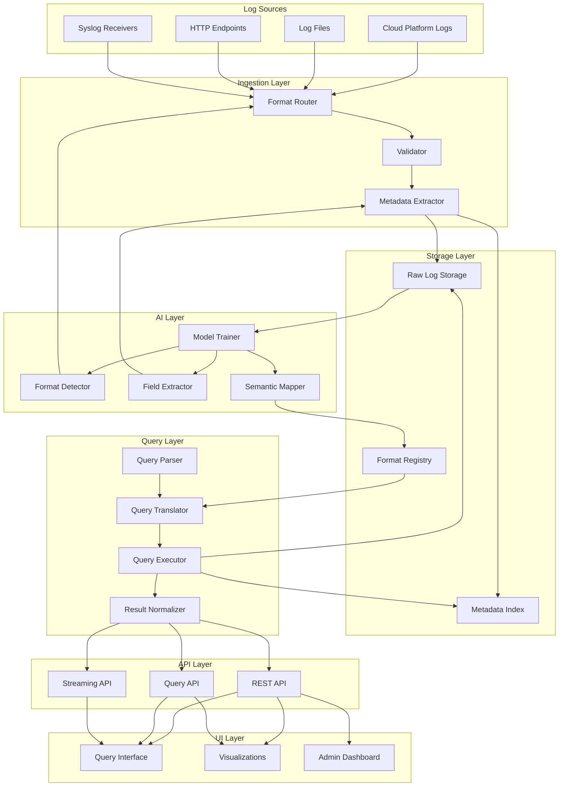
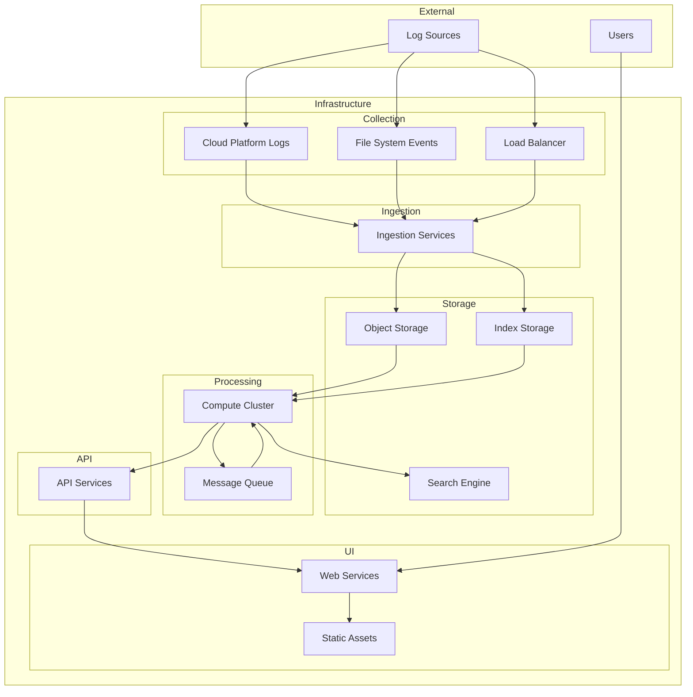

# Starbase Architecture

## Overview

Starbase is an open-source logging platform designed to revolutionize log management through a novel "query translation" approach rather than the traditional "data transformation" approach. This document outlines the high-level conceptual architecture of the system without committing to specific technologies.

## Architectural Principles

1. **Store Native, Translate Queries**: Store logs in their original format and translate queries to match each format.
2. **Minimize Ingestion Processing**: Perform minimal processing at ingestion time to reduce compute costs.
3. **Decouple Components**: Build loosely coupled components that can scale independently.
4. **AI-Powered Understanding**: Use machine learning to automate log understanding and mapping.
5. **Cost Optimization**: Design for economic efficiency at scale.

## Conceptual System Architecture

## Component Descriptions

### Ingestion Layer

1. **Format Router**
   - Routes logs to format-specific indexes (one format per index)
   - Uses HTTP as the initial ingestion protocol for simplicity
   - Provides dedicated endpoints for each log format
   - Designed for protocol extensibility to support higher throughput options
   - Supports batched log submission for improved efficiency

2. **Validator**
   - Ensures logs meet basic quality requirements
   - Rejects malformed logs
   - Standardizes timestamps and identifiers

3. **Metadata Extractor**
   - Extracts essential metadata for indexing
   - Identifies key fields for efficient retrieval
   - Adds system metadata (receipt time, source, etc.)

### Storage Layer

1. **Raw Log Storage**
   - Stores logs in their original format
   - Organizes storage for efficient retrieval
   - Implements tiered storage management
   - Handles compression and lifecycle policies

2. **Metadata Index**
   - Indexes key fields for efficient querying
   - Stores pointers to raw log locations
   - Optimizes for common query patterns
   - Supports time-based and field-based queries

3. **Format Registry**
   - Maintains mappings between formats and meta-model
   - Stores format-specific query translation rules
   - Manages schema evolution
   - Provides format documentation

### Query Layer

1. **Query Parser**
   - Parses queries written against the meta-model
   - Validates query syntax and semantics
   - Optimizes queries for execution
   - Handles complex query constructs

2. **Query Translator**
   - Translates meta-model queries to format-specific queries
   - Applies format-specific optimizations
   - Handles differences in query capabilities
   - Manages query federation across formats

3. **Query Executor**
   - Executes translated queries against raw storage
   - Manages distributed query execution
   - Implements query timeout and resource limits
   - Handles partial results and failures

4. **Result Normalizer**
   - Normalizes query results to a consistent format
   - Applies field mappings from format to meta-model
   - Handles result pagination and streaming
   - Formats results for different output needs

### AI Layer

1. **Format Detector**
   - Automatically identifies log formats
   - Detects format variations and versions
   - Provides confidence scores for format identification
   - Learns from user corrections

2. **Field Extractor**
   - Identifies fields within unstructured logs
   - Extracts field values and types
   - Handles complex field formats
   - Adapts to format variations

3. **Semantic Mapper**
   - Maps fields to meta-model concepts
   - Identifies semantic equivalences across formats
   - Suggests new mappings for unknown fields
   - Maintains mapping confidence scores

4. **Model Trainer**
   - Manages training data collection
   - Trains and evaluates models
   - Implements active learning for continuous improvement
   - Deploys updated models to production

### API Layer

1. **REST API**
   - Provides primary programmatic access
   - Implements CRUD operations for all resources
   - Supports authentication and authorization
   - Includes comprehensive documentation

2. **Query API**
   - Enables complex, nested queries
   - Allows clients to request exactly what they need
   - Supports advanced query capabilities
   - Optimized for data retrieval operations

3. **Streaming API**
   - Provides real-time updates
   - Supports streaming query results
   - Enables live dashboards
   - Implements efficient publish/subscribe mechanisms

### UI Layer

1. **Query Interface**
   - Provides intuitive query building
   - Supports both simple and advanced queries
   - Offers query templates and saved queries
   - Includes syntax highlighting and validation

2. **Visualizations**
   - Displays query results in various formats
   - Supports interactive exploration
   - Enables dashboard creation
   - Provides export capabilities

3. **Admin Dashboard**
   - Manages system configuration
   - Monitors system health
   - Provides usage statistics
   - Controls access and permissions

## Data Flow

### Ingestion Flow

1. Logs arrive from various sources to their format-specific endpoints
2. Format Router directs logs to their corresponding format-specific index
3. Validator ensures log quality
4. Metadata Extractor pulls out key fields
5. Raw log is stored in its original format
6. Metadata is indexed for efficient retrieval

### Query Flow

1. User submits a query against the meta-model
2. Query Parser validates and optimizes the query
3. Query Translator converts to format-specific queries
4. Query Executor runs queries against raw storage
5. Result Normalizer combines and normalizes results
6. API Layer delivers results to the client
7. UI Layer presents results to the user

### Learning Flow

1. Model Trainer selects sample logs for training
2. Format Detector learns to identify log formats
3. Field Extractor learns to extract fields
4. Semantic Mapper learns to map fields to meta-model
5. Models are continuously improved through feedback

## Deployment Considerations

Starbase is designed for flexible deployment across various environments:

### Infrastructure Components

The specific technologies for each component would be selected during the implementation phase, considering factors such as:

1. **Deployment Environment**
   - Cloud platform requirements
   - On-premises capabilities
   - Hybrid deployment needs

2. **Scale Requirements**
   - Expected log volume
   - Query performance needs
   - Storage capacity planning

3. **Operational Considerations**
   - Monitoring and management capabilities
   - Backup and disaster recovery
   - High availability requirements

4. **Cost Constraints**
   - Infrastructure costs
   - Operational overhead
   - Licensing considerations

## Security Considerations

Starbase requires a comprehensive security model:

1. **Authentication**
   - Identity management
   - Multi-factor authentication
   - External identity provider integration

2. **Authorization**
   - Role-based access control
   - Resource-level permissions
   - Field-level security

3. **Data Protection**
   - Encryption at rest
   - Encryption in transit
   - Key management

4. **Audit**
   - Comprehensive audit logging
   - Access tracking
   - Change history

## Scalability Considerations

Starbase is designed to scale horizontally:

1. **Ingestion Scaling**
   - Independent scaling of ingestion components
   - Auto-scaling based on input volume
   - Backpressure mechanisms

2. **Storage Scaling**
   - Distributed object storage
   - Scalable indexing
   - Partitioning for query performance

3. **Query Scaling**
   - Distributed query execution
   - Query resource limits
   - Caching and result reuse

## Future Architecture Considerations

1. **Multi-Environment Support**
   - Abstract environment-specific components
   - Implement environment-agnostic core
   - Support for various deployment models

2. **Edge Processing**
   - Local processing for latency-sensitive use cases
   - Edge-to-central synchronization
   - Offline operation

3. **Advanced AI Capabilities**
   - Anomaly detection
   - Predictive analytics
   - Natural language querying

This architecture document will evolve as the system is implemented and refined based on real-world experience and user feedback.
