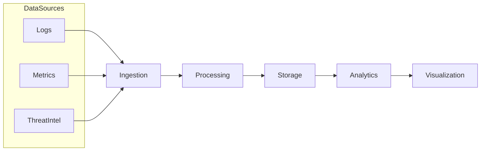
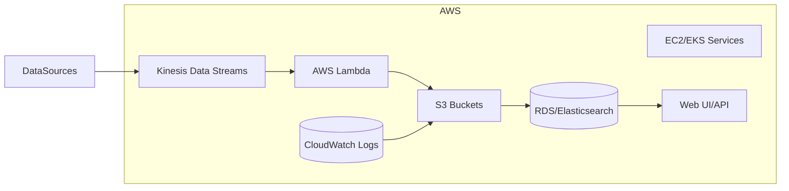

# Starbase Architecture Overview

This document outlines the initial architectural plan for Starbase, an open-source observability, SIEM, and CTI platform. The project is beginning with a single-tenant AWS deployment model.

## Architecture Work Plan

| Task ID | Description | Status |
|---------|-------------|--------|
| A1 | Gather functional and non-functional requirements | TODO |
| A2 | Design conceptual (Level 1) architecture | TODO |
| A3 | Design logical (Level 2) architecture with AWS services | TODO |
| A4 | Design physical (Level 3) architecture and deployment model | TODO |
| A5 | Define logging foundation and data flow | TODO |
| A6 | Review and iterate on diagrams and documentation | TODO |

Progress will be tracked by updating the **Status** column as work is completed.

## Conceptual Architecture

## Logical AWS Architecture (Level 2)

*This document is a starting point. Detailed diagrams and design decisions will be refined as the project progresses.*
