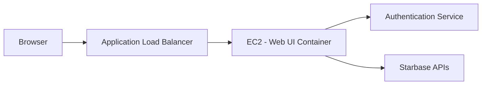

# Web UI Stack and EC2 Deployment

This document outlines the recommended framework for the Starbase web UI and how it can be deployed on EC2 instances. It also shows how the UI integrates with authentication and backend APIs as illustrated in [mvp_saas_agent_architecture.md](mvp_saas_agent_architecture.md).

## Recommended Framework

- **React with Next.js**: provides server-side rendering and an extensive ecosystem.
- **TypeScript**: ensures type safety across the UI codebase.
- **Material UI** or a similar component library for consistent styling.

Alternatives like Vue.js (with Nuxt.js) can also be considered, but React is the primary recommendation due to its popularity and community support.

## Integration with Authentication and APIs

The UI communicates with the Authentication Service to obtain tokens for calling backend APIs. This flow is detailed in [mvp_saas_agent_architecture.md](mvp_saas_agent_architecture.md).

The Authentication Service issues JWTs (or similar tokens) used by the UI when interacting with the Starbase APIs.

## Deployment on EC2

1. Build the UI as a container image using Docker.
2. Run the container on EC2 instances behind an Application Load Balancer.
3. Use an Auto Scaling Group to manage capacity and fault tolerance.
4. Serve the UI either via a Node.js server (for Next.js) or through Nginx for static assets.
5. Configure environment variables for API endpoints and authentication settings.

Refer to [architecture.md](architecture.md) for broader context and AWS components.
